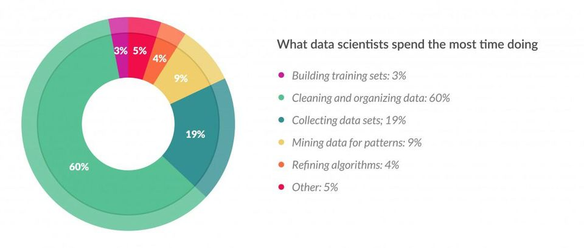

---
jupyter:
  jupytext:
    formats: ipynb,py,md
    text_representation:
      extension: .md
      format_name: markdown
      format_version: '1.1'
      jupytext_version: 1.2.3
  kernelspec:
    display_name: Python 3
    language: python
    name: python3
---

# Chapter 0. Introduction to Data Science

## 0.2 Data Science Technology

Data science technology evolves rapidly. One way to view technology is through the lense of how a data scientist spends their time.



### Data cleaning and Organization

As you can see from above, a lot of time is spent on cleaning and organizing data. What tools and technology are used for data cleaning and organization?
* Pipelines
* Databases

Pipelines can be as simple as a data scientist has custom scripts or commands to clean data in a standard way for their purposes, or as sophisticated as a generic platform from Google that attempts to automate data cleaning and processing.

```python

```
