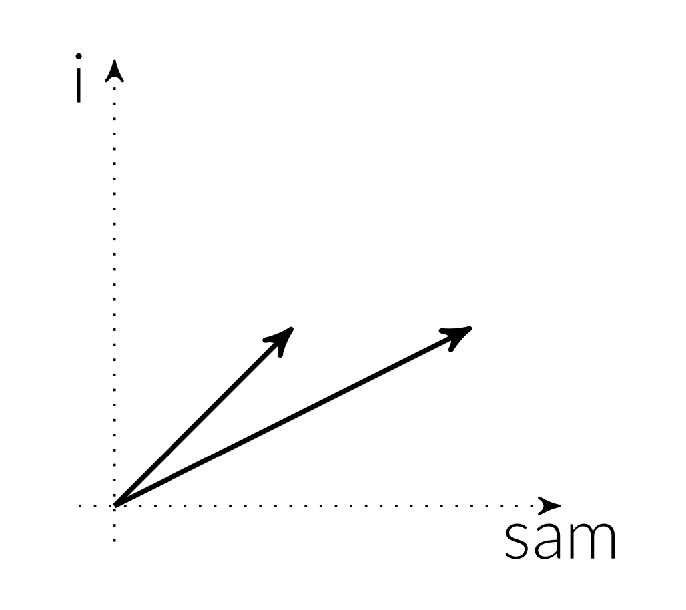
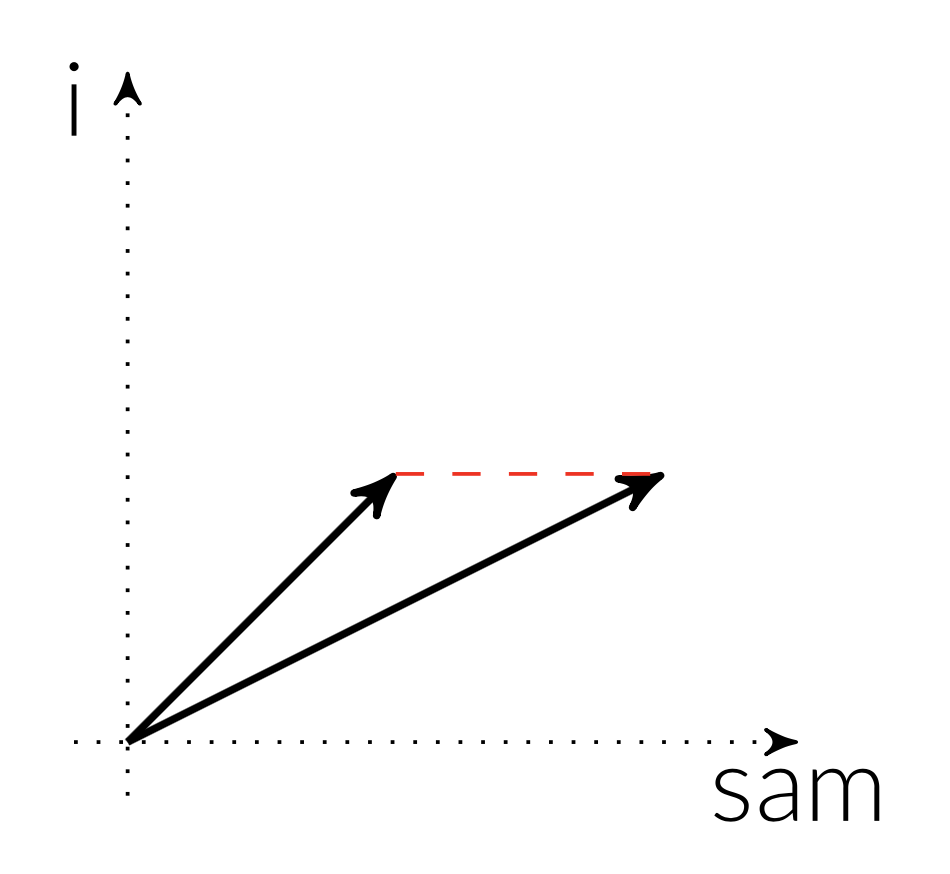
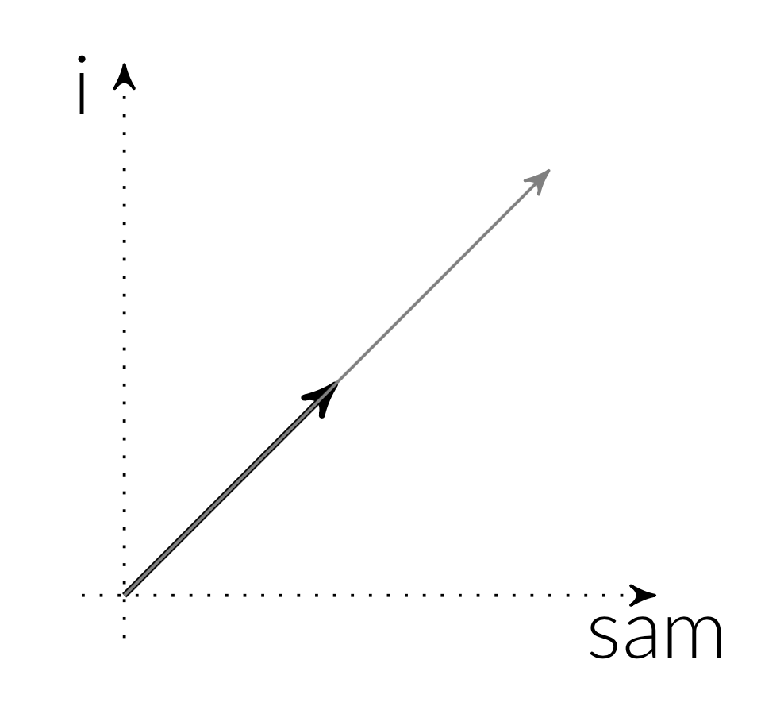
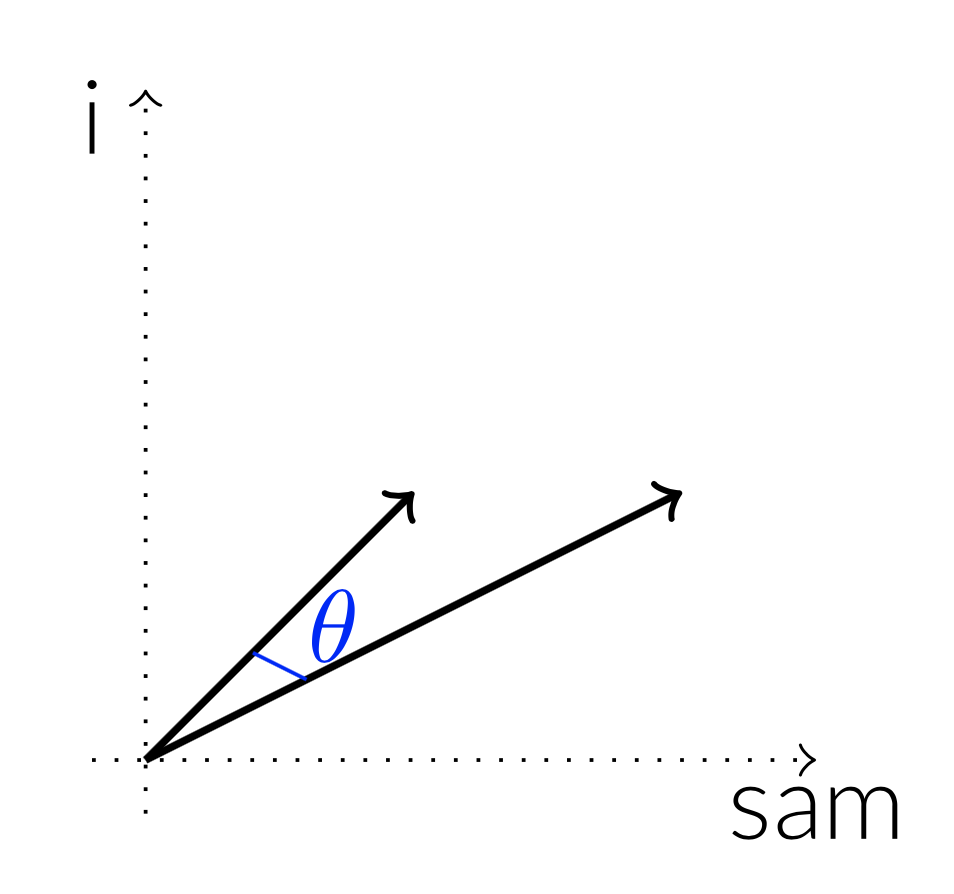

---
jupyter:
  jupytext:
    formats: ipynb,py,md
    text_representation:
      extension: .md
      format_name: markdown
      format_version: '1.1'
      jupytext_version: 1.2.4
  kernelspec:
    display_name: Python 3
    language: python
    name: python3
---

# 10.2 The Vector Space Model

In the previous section, we learned how to convert a document into a bag of words (or, more generally, a bag of $n$-grams) representation. In this section, we go one step further: how to turn the bag of words representation into the rows of a `DataFrame`.

Before we dive into the details, the representation of a document by a vector of numbers is called the **vector space model**. There are many ways to convert a bag of words representation into a vector of numbers, some of which we explore in this section.

```python
import numpy as np
import pandas as pd
pd.options.display.max_rows = 10
from collections import Counter

sms = pd.read_csv(
    "https://raw.githubusercontent.com/dlsun/data-science-book/master/data/SMSSpamCollection.txt", 
    sep="\t",
    names=["label", "text"]
)
```

## Term Frequencies

The bag of words representation gives us a list of word counts, like `{"I": 2, "am": 2, "Sam": 2}`. To turn this into a vector of numbers, we can simply take the word counts, for each word in a prespecified vocabulary, as follows:

| a | I | am | the | Sam | ... |
|---|---|----|-----|-----|-----|
| 0 | 2 | 2  |  0  | 2   | ... |

We can do this for each document in the corpus, to obtain the **term-frequency matrix**.

Let's obtain the term-frequency matrix for the text message corpus. But let's restrict to just the first 100 messages and just words containing only letters. (Otherwise, we end up with "words" that are phone numbers and addresses.)

```python
from collections import Counter

bag_of_words = (
    sms.loc[:100, "text"].
    str.lower().
    str.replace("[^A-Za-z\s]", "").
    str.split()
).apply(Counter)

bag_of_words
```

To make a term-frequency matrix out of this data, we need to convert it to a `DataFrame`, where each column represents a word and each row a document---and the cells contain the count of that word in the document.

```python
tf = pd.DataFrame(list(bag_of_words))
tf
```

Although there are a few numbers in this matrix, it is mostly NaNs. That simply means that the word did not appear in the dictionary for that document. In other words, a NaN really means a count of 0. So let's replace the NaNs by 0s.

```python
tf = tf.fillna(0)
tf
```

You might be tempted at this point to run the same code on the entire corpus of text messages. But the number of columns (i.e., the size of the vocabulary) quickly grows out of control. There are about 9000 unique words in the entire corpus, and storing that many columns is on the edge of what `pandas` can handle.

But we observed above that _most of the entries in this matrix are zero._ Instead of storing all the entries in this matrix, we can simply store the locations (row and column index) of the non-zero elements and their values. All of the remaining entries are assumed to be zeroes. This is called a **sparse** representation of the matrix.

To get a sparse representation of the term-frequency matrix, we use the `CountVectorizer` object in Scikit-Learn.  This object takes in a list of strings, splits each string into words, counts them, and returns the term-frequency matrix. By default, it converts all letters to lowercase and strips punctuation, although this behavior can be customized.

```python
from sklearn.feature_extraction.text import CountVectorizer

vec = CountVectorizer()
vec.fit(sms["text"]) # This determines the vocabulary.
tf_sparse = vec.transform(sms["text"])
```

A sparse matrix can be converted to a **dense** matrix if necessary, using the `.todense()` method. But be careful. If the matrix is large, you do not want to do this!

```python
tf_sparse.todense()
```

Notice that the resulting object is no longer a `DataFrame`. It is simply a matrix of numbers. Each column corresponds to a word (and, if necessary, we can find the mapping between words and columns in `vec.vocabulary_`). But the word counts themselves are not of primary interest. We now have a completely numerical representation of every text document that can be passed into a machine learning model, like $k$-nearest neighbors.


We can even count bigrams using `CountVectorizer` by specifying `ngram_range`. If we wanted both unigrams (i.e., individual words) and the bigrams, then we would specify `ngram_range=(1, 2)`. If we want just the bigrams, then we would specify `ngram_range=(2, 2)`. Let's do the latter:

```python
vec = CountVectorizer(ngram_range=(2, 2))
vec.fit(sms["text"])
vec.transform(sms["text"])
```

There are over 40000 bigrams. This is another reason to avoid using $n$-grams for large $n$; even if they capture more of the meaning of a sentence, they quickly blow up the size of our data.


## TF-IDF

The problem with term frequencies (TF) is that common words like "the" and "that" tend to have high counts and dominate. A better indicator of whether two documents are similar is if they share rare words. For example, the word "subpoena" might only appear in a few documents in a corpus, but the presence of that word in two documents is a strong indicator that the documents are similar, so we should give more weight to terms like it.

This is the idea behind TF-IDF. We take each term frequency and re-weight it according to how many documents that term appears in (i.e., the **document frequency**). Since we want words that appear in fewer documents to get more weight, we take the **inverse document frequency** (IDF).  We take the logarithm of IDF because the distribution of IDFs is heavily skewed to the right. (Remember the discussion about transforming data from Chapter 1.4.) So in the end, the formula for IDF is:

$$ \textrm{idf}(t, D) = \log \frac{\text{# of documents}}{\text{# of documents containing $t$}} = \log \frac{|D|}{|d \in D: t \in d|}. $$

(Sometimes, $1$ will be added to the denominator to prevent division by zero, if there are terms in the vocabulary that do not appear in the corpus.)

To calculate TF-IDF, we simply multiply the term frequencies by the inverse document frequencies:

$$ \textrm{tf-idf}(d, t, D) = \textrm{tf}(d, t) \cdot \textrm{idf}(t, D). $$

Notice that unlike TF, the TF-IDF representation of a given document depends on the entire corpus of documents.

Let's first see how to calculate TF-IDF from scratch, using the term-frequency matrix we obtained above.

```python
# Get document frequencies 
# (How many documents does each word appear in?)
df = (tf > 0).sum(axis=0)
df
```

```python
# Get IDFs
idf = np.log(len(tf) / df)
idf
```

```python
# Calculate TF-IDFs
tf_idf = tf * idf
tf_idf
```

We will not generally implement TF-IDF from scratch, like we did above. Instead, we will use Scikit-Learn's `TfidfVectorizer`, which operates similarly to `CountVectorizer`, except that it returns a matrix of the TF-IDF weights.

```python
from sklearn.feature_extraction.text import TfidfVectorizer

vec = TfidfVectorizer(norm=None) # Do not normalize.
vec.fit(sms["text"]) # This determines the vocabulary.
tf_idf_sparse = vec.transform(sms["text"])
tf_idf_sparse
```

## Cosine Similarity

We now have a representation of each text document as a vector of numbers. Each number can either be a term frequency or a TF-IDF weight. We can visualize each vector as an arrow in a high-dimensional space, where each dimension represents a word. The magnitude of the vector along a dimension represents the "frequency" (TF or TF-IDF) of that word in the document. For example, if our vocabulary only contains two words, "i" and "sam", then the arrows shown below might represent two documents:



To fit $k$-nearest neighbors or $k$-means clustering, we need some way to measure the distance between two documents (i.e., two vectors). We could use Euclidean distance, as we have done in the past.



But Euclidean distance does not make sense for TF or TF-IDF vectors. To see why, consider the two documents:

1. "I am Sam." 
2. "I am Sam. Sam I am." 

The two documents are obviously very similar. But the vector for the second is twice as long as the vector for the first because the second document has twice as many occurrences of each word. This is true whether we use TF or TF-IDF weights. If we calculate the Euclidean distance between these two vectors, then they will seem quite far apart.



With TF and TF-IDF vectors, the distinguishing property is their _direction_. Because the two vectors above point in the same direction, they are similar. We need a distance metric that measures how different their directions are. A natural way to measure the difference between the directions of two vectors is the angle between them.



The cosine of the angle between two vectors ${\bf a}$ and ${\bf b}$ can be calculated as:

$$ \cos \theta = \frac{\sum a_j b_j}{\sqrt{\sum a_j^2} \sqrt{\sum b_j^2}}. $$

Although it is possible to work out the angle $\theta$ from this formula, it is more common to report $\cos\theta$ as a measure of similarity between two vectors. This similarity metric is called **cosine similarity**. Notice that when the angle $\theta$ is close to 0 (i.e., when the two vectors point in nearly the same direction), the value of $\cos\theta$ is high (close to 1.0, which is the maximum possible value).

The cosine _distance_ is defined as 1 minus the similarity. This makes it so that 0 means that the two vectors point in the same direction:

$$ d_{\cos}({\bf a}, {\bf b}) = 1 - \cos(\theta({\bf a}, {\bf b})) = 1 - \frac{\sum a_j b_j}{\sqrt{\sum a_j^2} \sqrt{\sum b_j^2}}. $$

Let's calculate the cosine similarity between the 0th and 2nd text messages using the TF-IDF representation.

```python
# Calculate the numerator.
a = tf_idf_sparse[0, :]
b = tf_idf_sparse[2, :]
dot = a.multiply(b).sum()

# Calculate the terms in the denominator.
a_len = np.sqrt(a.multiply(a).sum())
b_len = np.sqrt(b.multiply(b).sum())

# Cosine similarity is their ratio.
dot / (a_len * b_len)
```

These two vectors are not very similar, as evidenced by their low cosine similarity (close to 0). Let's try to find the most similar documents in the corpus to the 0th text message---in other words, its nearest neighbors. To do this, we will take advantage of _broadcasting_: we will multiply a TF-IDF vector (for the 0th text message) by the entire TF-IDF matrix and calculate the sum over the columns. This will give us a vector of dot products.

```python
# Calculate the numerators.
a = tf_idf_sparse[0, :]
B = tf_idf_sparse
dot = a.multiply(B).sum(axis=1)
dot
```

```python
# Calculate the denominators.
a_len = np.sqrt(a.multiply(a).sum())
b_len = np.sqrt(B.multiply(B).sum(axis=1))
print(a_len)
b_len
```

```python
# Calculate their ratio to obtain cosine similarities.
dot / (a_len * b_len)
```

The warning message is the result of dividing by zero. (Some text messages have no words when you remove all the punctutation.)

Now let's put this matrix into a `DataFrame` so that we can easily sort the values in descending order.

```python
cos_similarities = pd.DataFrame(dot / (a_len * b_len))[0]
most_similar = cos_similarities.sort_values(ascending=False)
most_similar
```

Obviously, the most similar text to the 0th text (with a perfect cosine similarity of 1.0) is itself. But other similar texts include 5511, 1351, 3713, and 605. Let's go back to the original data and read some of the other similar texts.

```python
for i, text in sms["text"][most_similar.index[:10]].items():
    print(i, text)
```

Let's see if we can reverse engineer why these particular text messages were deemed to be similar.

- Text 5511 is similar because it shares the uncommon words "crazy" and "world". (It also shares the word "in", but this word is common, so it likely has a low TF-IDF weight.)
- Text 1351 is judged as similar because it shares the uncommon words "bugis" and "wat".
- And so on...

Going through the most similar documents, you see that they all share uncommon words with text message 0. This is exactly what TF-IDF was designed to do.


# Exercises


**Exercise 1.** Suppose we had instead compared documents using cosine similarity on the term frequencies (TF), instead of TF-IDF. Which text messages would be most similar to message 0 now?

```python
# TYPE YOUR CODE HERE
```

**Exercise 3.** Suppose we normalize the length of each TF-IDF vector

$$ {\bf v} \leftarrow \frac{{\bf v}}{\sqrt{\sum_j v_j^2}} $$

before calculating Euclidean distance. Which text messages would be most similar to message 0 now? How does this ranking compare with the ranking we obtained earlier using cosine similarity on the (unnormalized) vectors?

_Challenge Exercise:_ Can you prove the above fact mathematically?

```python
# TYPE YOUR CODE HERE
```

**Exercise 4.** Write a function `predict_spam()` that takes in a new text message and predicts whether or not it is spam using $9$-nearest neighbors on the text messages data set above. Some code has been provided for you. Use cosine distance ($= 1 - \text{cosine similarity}$) as your distance metric. (Because `KNeighborsClassifier` in Scikit-Learn does not support cosine distance, you will have to implement $k$-nearest neighbors from scratch.)

Use your model to predict whether the text messages "meet you at jurong place" and "free cash" are spam or not.

```python
# TYPE YOUR CODE HERE.
vec = TfidfVectorizer(norm=False)
vec.fit(sms["text"])
X_train = vec.transform(sms["text"])
X_train_len = np.sqrt(X_train.multiply(X_train).sum(axis=1))
y_train = sms["label"]

def predict_spam(new_text):
    # Get the TF-IDF vector for the new text.
    x_new = vec.transform([new_text])[0, :]
    raise NotImplementedError
    

print(predict_spam("meet you at jurong place"))
print(predict_spam("free cash"))


```

**Exercise 5** The above statement about sklearn and cosine distance calculation can be more clearly stated that cosine similiarity is not a metric that can be used by accelerating structures like ball and kd trees with it. In newer version of sklearn, you can specify metric='cosine'. Modify the the code from 10.1 to use cosine.
<pre>
from sklearn.feature_extraction.text import CountVectorizer
from sklearn.model_selection import GridSearchCV
from sklearn.pipeline import Pipeline
from sklearn.neighbors import KNeighborsClassifier

import pandas as pd
pd.options.display.max_rows = 10

texts = pd.read_csv(
    "https://raw.githubusercontent.com/dlsun/data-science-book/master/data/SMSSpamCollection.txt", 
    sep="\t",
    names=["label", "text"]
)

# #############################################################################
# Define a pipeline combining a text feature extractor with a simple
# classifier
pipeline = Pipeline([
    ('vect', CountVectorizer()),
    ('clf', KNeighborsClassifier()),
])

# uncommenting more parameters will give better exploring power but will
# increase processing time in a combinatorial way
parameters = {
    'vect__max_df': (0.5, 0.75, 1.0),
    # 'vect__max_features': (None, 5000, 10000, 50000),
    'vect__ngram_range': ((1, 1), (1, 2)),  # unigrams or bigrams
    'clf__n_neighbors': [5,10,30]
}

grid_search = GridSearchCV(pipeline, parameters, cv=3,
                           n_jobs=-1, verbose=1,scoring='f1_macro')

grid_search.fit(texts['text'], texts['label'])
</pre>

```python
# YOUR CODE HERE
```
```python

```

