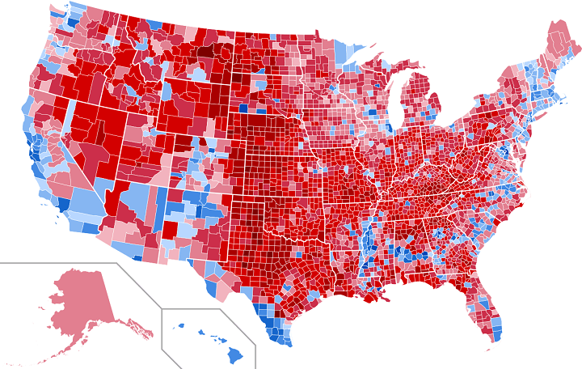

---
jupyter:
  jupytext:
    formats: ipynb,py
    text_representation:
      extension: .md
      format_name: markdown
      format_version: '1.1'
      jupytext_version: 1.2.3
  kernelspec:
    display_name: Python 3
    language: python
    name: python3
---

# 12.3 Choropleths

A **choropleth** is a map in which areas are colored according to some statistic of interest. Perhaps the most familiar example of a choropleth is the presidential election map, which shows the percentage in each county who voted for the Democratic or Republican candidate. In this graphic, the observational units are counties, and the statistic of interest is the percentage who voted for the Democratic (or Republican) candidate. 



In this notebook, you will learn how to make choropleths like the one above.


## Shapefiles

The shapefile format is a data format for geometric objects, such as points, lines, and polygons. A shapefile can be used to describe the boundaries of a lake, the course of a river, or the boundaries of a county.

You can find shapefiles for most geographic entities online. For example, the [U.S. Census Bureau](https://www.census.gov/geo/maps-data/data/tiger-cart-boundary.html) maintains shapefiles for boundaries of states, counties, and congressional districts in the United States. Shapefiles for the countries of the world can be found [at this website](http://thematicmapping.org/downloads/world_borders.php).

I downloaded the shapefiles for U.S. counties from the Census Bureau website and uploaded them to JupyterHub. You can find them in the `/data301/data/cb_2017_us_county_5m/` directory.

```python
!ls /data301/data/cb_2017_us_county_5m/
```

Notice that "shapefile" is somewhat of a misnomer, as the format refers not to a single file but a collection of files. The main files are:

- `.shp` - shape format, which stores the geometric objects
- `.shx` - shape index format, which indexes the objects to make them quickly searchable
- `.dbf` - attribute format, which stores additional metadata about each object
- `.prj` - projection format

To read in a shapefile using Basemap, we first set up the map, then call the `.readshapefile()` method, which takes two arguments: (1) the stem of the shapefiles (without the file extension) and (2) a name for the field that will store the attributes (you can pick any name you like, but try to be descriptive).

```python
import matplotlib.pyplot as plt
%matplotlib inline

import cartopy.crs as ccrs
from cartopy.io.shapereader import Reader
from cartopy.feature import ShapelyFeature

ax = plt.axes(
    projection=ccrs.LambertConformal(
        central_latitude=39,
        central_longitude=-96,
        standard_parallels=(33, 45)
    )
)
ax.set_extent([-125, -66.5, 20, 50])

# Read in county-level shapefiles
fname = "/data301/data/cb_2017_us_county_5m/cb_2017_us_county_5m"
shp = Reader(fname)

# Add each county to the data set.
ax.add_geometries(shp.geometries(),
                  ccrs.PlateCarree(),
                  facecolor="None",
                  edgecolor='black')
```

To make a choropleth, we simply need to set the `facecolor` of each geometry. First, let's read in some county-level data that we can plot.

```python
import pandas as pd
election_df = pd.read_csv("https://raw.githubusercontent.com/dlsun/data-science-book/"
                            "master/data/election2016.csv")
election_df
```

We need to merge this data with the shapefile that we just loaded. We can create a `DataFrame` out of the `records` of a shapefile.

```python
shp_df = pd.DataFrame(
    [record.attributes for record in shp.records()]
)
shp_df
```

We will need to merge `election_df` with `shp_df`. But what do we merge the `DataFrame`s on? It turns out that every county in the United States is assigned a unique ID called a FIPS code. The FIPS code appears in `election_df` as `combined_fips` and in `shp_df` as `GEOID`. Let's take a look at these columns.

```python
election_df.combined_fips
```

```python
shp_df.GEOID
```

Notice that `shp_df` treats the FIPS code as a string (so every FIPS code is exactly 5 digits, with a leading zero if necessary). On the other hand, `election_df` treats the FIPS code as an integer. If we want to join the two, we will have to cast them to the same type. It is probably easier to convert the string to an integer than vice versa.

```python
shp_df["GEOID"] = shp_df["GEOID"].astype(int)
```

Now we are ready to merge the two `DataFrame`s.

```python
all_data = shp_df.merge(election_df, 
                        how="left", 
                        left_on="GEOID", right_on="combined_fips")
all_data
```

Now let's plot each county, with the `facecolor` representing the percentage of voters in each county that voted for the Democratic candidate (`per_dem`). To do this, we normalize all values to be between 0 and 1, and define a color map that maps numbers in $[0, 1]$ to a color.

```python
ax = plt.axes(
    projection=ccrs.LambertConformal(
        central_latitude=39,
        central_longitude=-96,
        standard_parallels=(33, 45)
    )
)
ax.set_extent([-125, -66.5, 20, 50])

# Read in county-level shapefiles
fname = "/data301/data/cb_2017_us_county_5m/cb_2017_us_county_5m"
shp = Reader(fname)

# define a normalizer and a color map
import matplotlib as mpl
norm = mpl.colors.Normalize(vmin=all_data["per_dem"].min(), 
                            vmax=all_data["per_dem"].max())
cmap = plt.cm.RdBu

# plot the geometries with a facecolor that depends on per_dem
for geometry, (_, row) in zip(shp.geometries(), all_data.iterrows()):
    if ~pd.isnull(row["per_dem"]):
        ax.add_geometries([geometry],
                          ccrs.PlateCarree(),
                          facecolor=cmap(norm(row["per_dem"])))
```

# Exercises


**Exercise 1.** Use the shapefiles for the countries of the world (`/data301/data/TM_WORLD_BORDERS_SIMPL-0.3/`) to make a choropleth showing carbon dioxide emissions per capita in 2014 (`/data301/data/co2.csv`).

(_Hint:_ Some countries are missing data. One way to handle this is to: (1) fill the missing values with an arbitrary value in the range when making the initial map, and (2) go back and re-draw the polygons for those countries on top of the existing map, using a special face color to indicate that data was missing.)

```python
# TYPE YOUR CODE HERE.
```
