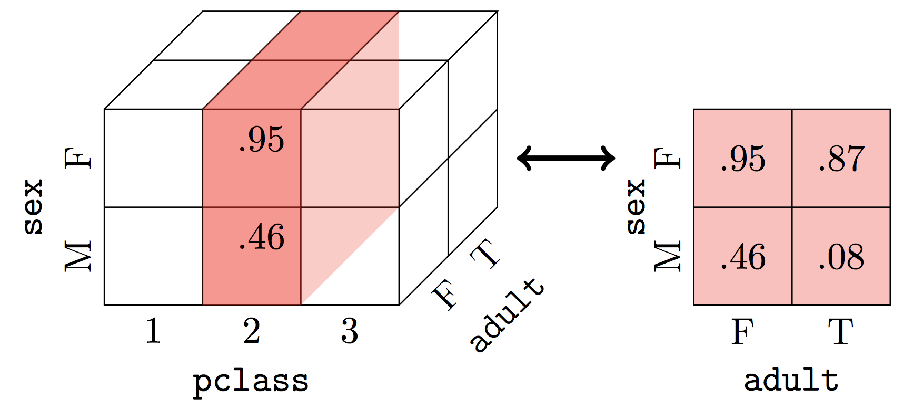
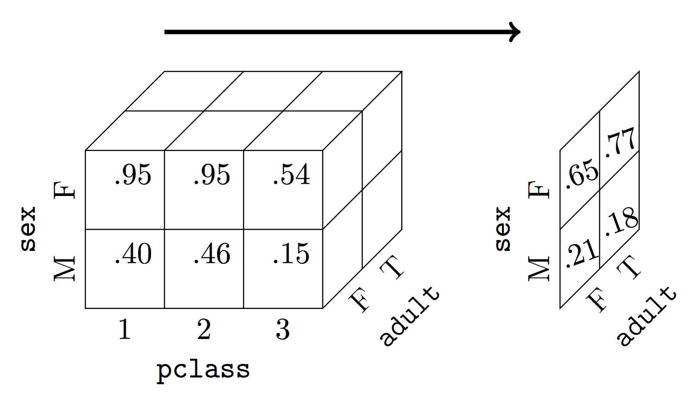

---
jupyter:
  jupytext:
    formats: ipynb,md
    text_representation:
      extension: .md
      format_name: markdown
      format_version: '1.1'
      jupytext_version: 1.2.4
  kernelspec:
    display_name: Python 3
    language: python
    name: python3
---

# 2.4 Data Cube Operations

Data cubes are $d$-dimensional hypercubes. We can answer questions about a data set by manipulating this hypercube. In this section, we will study three basic operations: slicing, dicing, and roll-ups.

```python
%matplotlib inline
import numpy as np
import pandas as pd
titanic_df = pd.read_csv("https://raw.githubusercontent.com/dlsun/data-science-book/master/data/titanic.csv")

titanic_df["adult"] = (titanic_df["age"] >= 18)

survival_cube = titanic_df.pivot_table(
    index="sex", columns=["pclass", "adult"],
    values="survived", aggfunc=np.mean)
survival_cube
```

# Slicing

**Slicing** a data cube refers to fixing the value of one dimension of the hypercube. For example, suppose we only want to know the survival rates of passengers in second class. To do this, we fix the value of `pclass` at 2 and look at the survival rates over the other dimensions. 

It is easy to see why this operation is called "slicing" if you imagine a three-dimensional cube. When we fix the value of one dimension, we are essentially slicing the cube at that value, as shown in the figure below.



Each slice reduces the dimension of a data cube by one. If the original data cube had $d$ dimensions, then the slice has $d-1$ dimensions.

To slice a pivot table in `pandas`, we simply access the corresponding row or column in the `DataFrame`. For example, to get the survival rates for the passengers in second class from the data cube above, we can simply select the column labeled 2. The result is a two-dimensional data cube:

```python
survival_cube[2]
```

Depending on how the pivot table is arranged, the slice is sometimes not in data cube form. For example, if we slice the data cube to get only the data for male passengers, the output is two-dimensional but not in data cube form:

```python
survival_cube.loc["male"]
```

But it is easy to convert this tabular data into a data cube; we simply unstack the `Series` so that each value of `adult` is a separate column.

```python
survival_cube.loc["male"].unstack()
```

## Cross-section


Slicing was easy in the two examples above because `pclass` and `sex` were both the outermost (i.e., first) level in their respective indexes. But what if we want to slice on a dimension that is buried in some intermediate level of a `MultiIndex`? We can use the "cross-section" function (`.xs`) of `pandas`. For example, the following code returns the survival rates for the children on the Titanic:

```python
survival_cube.xs(False, level="adult", axis=1)
```

This code tells `pandas` to return all columns (because `axis=1`) of `survival_cube` where `adult` is equal to `False`.


# Dicing

**Dicing** is like slicing, except that we fix the values of two or more dimensions. For example, if we want to know the survival rates of males in second class, we could dice the data cube as follows:

```python
survival_cube.loc["male", 2]
```

Notice that the result is one-dimensional, since there is only one remaining dimension that we have not fixed (`adult`). In general, if we dice a $d$-dimensional data cube along $k$ dimensions, the result will be a $(d-k)$-dimensional data cube. In the example above, $d=3$ and $k=2$, so the output had $d-k=1$ dimensions.


# Roll-ups

The data cube above contains information about the survival rate by `pclass`, `sex`, and `adult`. But what if we are only interested in the survival rate by `sex` and `adult`? To do this, we have to **roll-up** data cube over the variable `pclass`.

The roll-up operation is diagrammed in the figure below. We want to collapse the `pclass` dimension, resulting in a two-dimensional data cube over `sex` and `adult`. Just as with the slicing operation, each roll-up operation reduces the dimension of the data cube by one.



What is the best way to calculate roll-ups? This is a trick question: the best way is to avoid calculating them at all! If we calculate the roll-ups when the pivot table is first created, then we can just look them up without having to calculate them. To get the roll-ups alongside the cell values, we specify `margins=True` in `.pivot_table()`.

```python
survival_cube_with_rollups = titanic_df.pivot_table(
    index=["sex", "adult"], columns="pclass",
    values="survived", aggfunc=np.mean,
    margins=True
)

survival_cube_with_rollups
```

Compared with the default pivot table (i.e., without `margins=True`), this pivot table has an extra row and an extra column, both labeled "All". They are in the _margins_ of the original table (which is why the extra argument to `.pivot_table()` was `margins=True`). This additional row and column contain various lower-dimensional roll-ups of the original data cube:

- The cell in the bottom right of this table is the roll-up of all three dimensions. In other words, it is the overall survival rate.
- The other values in the last column (labeled "All") represent the roll-up of `pclass`. In other words, they are the survival rates by `sex` and `adult`.
- The other values in the last row (labeled "All") represent the roll-up of both `sex` and `adult`. In other words, they are the survival rates by `pclass`.

However, this table does not store all the possible roll-ups of the three-dimensional datacube. For example, it does not store the roll-up of `sex`, nor does it store the roll-up of both `pclass` and `adult`. When designing a pivot table, it is a good idea to think about which roll-ups are most important and to choose the row indexes and columns accordingly so that those roll-ups are available.


## Calculating Your Own Roll-Ups

Suppose you forgot to include the roll-ups when you first created the pivot table, or perhaps you need a roll-up that your pivot table does not provide. In most cases, there is no way to reconstruct the roll-ups from just the data cube. However, for some metrics, it is possible to reconstruct the roll-ups from the data cube.

For example, consider a data cube that stores the _number_ of survivors by `sex`, `adult`, and `pclass`.

```python
num_survivors_cube = titanic_df.pivot_table(
    index=["sex", "adult"], columns="pclass",
    values="survived", aggfunc=np.sum
)

num_survivors_cube
```

Now, if we want to roll-up the `pclass` variable, we can calculate the total number of survivors by summing the numbers in first, second, and third class. In other words, we need to sum each row of the `DataFrame` above. This is possible using `.sum()`, but we have to specify an additional keyword argument, `axis=`, so that `pandas` knows which dimension to sum over:

- `axis=0` means aggregate _over_ the rows (i.e., dimension 0), returning one number per column
- `axis=1` means aggregate _over_ the columns (i.e., dimension 1), returning one number per row

Because we want the sum of each row, we are aggregating over the columns; thus we need to sum over `axis=1`:

```python
num_survivors_cube.sum(axis=1)
```

As a sanity check, let's make sure these numbers match the results from `.pivot_table()` when we set `margins=True`:

```python
titanic_df.pivot_table(
    index=["sex", "adult"], columns="pclass",
    values="survived", aggfunc=np.sum,
    margins=True
)
```

The numbers in the "All" column match exactly!


# Exercises


**Exercise 1.** We saw one case where it was possible to manually reconstruct roll-ups using only the values in a data cube.

Is it possible to calculate the roll-up of `pclass` from just the values in `survival_cube` (a pivot table defined above)? In other words, can we reconstruct the survival rates by `sex` and `adult` from just the survival rates in `survival_cube`? Try a few different approaches and compare the results against the true answer, which you can obtain using `.groupby()` or `.pivot_table(..., margins=True)`.

```python
# TYPE YOUR CODE HERE.
```

Exercises 2-4 deal with the Tips data set (`https://raw.githubusercontent.com/dlsun/data-science-book/master/data/tips.csv`).


**Exercise 2.** Create a pivot table that shows the average total bill by day, time, and table size. Include roll-ups with this pivot table that make it easy to answer questions like, "Is the average bill higher for lunch or dinner?"

```python
# TYPE YOUR CODE HERE.
```

**Exercise 3.** Create a pivot table that shows that average total bill by day and time for parties of size 2. (Don't do this by calling `.pivot_table()` on the original data. You should be able to do this using just the pivot table you created in Exercise 2.)

```python
# TYPE YOUR CODE HERE.
```

```python
import pandas as pd
import numpy as np
df = pd.read_csv(
    "https://raw.githubusercontent.com/dlsun/data-science-book/master/data/tips.csv")
display(df.head())
display(df.columns)
df_cube = df.pivot_table(
    index="size", columns=["time","day"],
    values="total_bill", aggfunc=np.mean)
df_cube.xs(2,axis=0)
```

**Exercise 4.** How would you create a pivot table that shows the average total bill by day and time? Is it possible to do this using just the pivot table you created in Exercise 2?

```python
# TYPE YOUR CODE HERE.
```

```python

```
