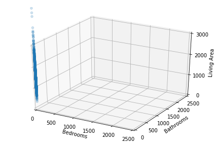
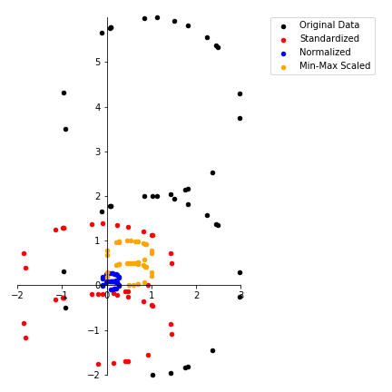

---
jupyter:
  jupytext:
    formats: ipynb,md
    text_representation:
      extension: .md
      format_name: markdown
      format_version: '1.1'
      jupytext_version: 1.2.4
  kernelspec:
    display_name: Python 3
    language: python
    name: python3
---

# Chapter 4. Relationships between Observations

The previous chapter discussed ways to measure relationships between variables, or the _columns_ of a `DataFrame`. This chapter is about how to measure relationships between observations, or the _rows_ of a `DataFrame`.

# Chapter 4.1 Distance Metrics

How do we quantify how "similar" two observations are? We will use the Ames housing data set, but to keep things simple, we will work with just three quantitative variables from that data set: the number of bedrooms, the number of bathrooms, and the living area (in square feet).

```python
%matplotlib inline
import numpy as np
import pandas as pd
pd.options.display.max_rows = 5

housing_df = pd.read_csv("https://raw.githubusercontent.com/dlsun/data-science-book/master/data/AmesHousing.txt",
                         sep="\t")

# extract 3 quantitative variables
housing_df_quant = housing_df[["Bedroom AbvGr", "Gr Liv Area"]].copy()
housing_df_quant["Bathrooms"] = (
    housing_df["Full Bath"] + 
    0.5 * housing_df["Half Bath"]
)
housing_df_quant
```

Shown below is a (three-dimensional) scatterplot of these variables. Consider the two observations connected by a red line. (The label next to each point is its index in the `DataFrame`.) To measure how similar they are, we can calculate the distance between the two points.


Calculating the distance between two points is not as straightforward as it might seem because there is more than one way to define distance. The one most familiar to you is probably **Euclidan distance**, which is the straight-line distance ("as the crow flies") between the two points. The formula for calculating this distance is a generalization of the Pythagorean theorem:

$$ d({\bf x}, {\bf x'}) = \sqrt{\sum_{j=1}^D (x_j - x'_j)^2} $$

```python
x = housing_df_quant.loc[2927]
x1 = housing_df_quant.loc[2928]

x - x1
```

```python
(x - x1) ** 2
```

```python
np.sqrt(((x - x1) ** 2).sum())
```

The beauty of this definition is that it generalizes to more than three dimensions. Even though it is difficult to visualize points in 100-dimensional space, we can calculate distances between them in exactly the same way.

However, Euclidean distance is not the only way to measure how far apart two points are. There is also [**Manhattan distance**](https://en.wikipedia.org/wiki/Taxicab_geometry) (also called _taxicab distance_), which measures the distance a taxicab in Manhattan would have to drive to travel from A to B. Taxicabs are not able to travel in a straight line (i.e., the green path below) because they have to follow the street grid. But there are multiple paths along the street grid that all have exactly the same length (i.e., the red, yellow, and blue paths below); the Manhattan distance is the length of any one of these shortest paths.


The formula for Manhattan distance is actually quite similar to the formula for Euclidean distance. Instead of squaring the differences and taking the square root at the end (as in Euclidean distance), we simply take absolute values:
$$ d({\bf x}, {\bf x'}) = \sum_{j=1}^D |x_j - x'_j|. $$

The following code calculates Manhattan distance:

```python
((x - x1).abs()).sum()
```

### Comparison of Euclidean and Manhattan distance

The Euclidean distance was essentially just the largest difference. This is because Euclidean distance first _squares_ the differences. The squaring operation has a "rich get richer" effect; larger values get magnified by more than smaller values. As a result, the largest differences tend to dominate the Euclidean distance.

On the other hand, Manhattan distance treats all differences equally. So Manhattan distance is preferred if you are concerned that an outlier in one variable might dominate the distance metric.


## The Importance of Scaling

Here's a quiz. There are two pairs of observations in the figure below, one connected by a red line, the other connected by an orange line. Which pair of observations is more similar (assuming we use Euclidean distance)?


Let's actually calculate these two distances.

```python
# Distance between two points connected by red line
x = housing_df_quant.loc[2927]
x1 = housing_df_quant.loc[2928]

np.sqrt(((x - x1) ** 2).sum())
```

```python
# Distance between two points connected by orange line
x = housing_df_quant.loc[2498]
x1 = housing_df_quant.loc[290]

np.sqrt(((x - x1) ** 2).sum())
```

Surprised by the answer? The scatterplot is deceiving because it automatically scales the variables to make the points fit on the same plot. In reality, the variables are on very different scales. The number of bedrooms and bathrooms range from 0 to 6, while living area is in the thousands. When variables are on such different scales, the variable with the largest variability will dominate the distance metric.

The plot below shows the same data, but drawn to scale. You can see that differences in the number of bedrooms and the number of bathrooms hardly matter at all; only the variability in the living area matters.




To obtain distances that agree more with our intuition---and that do not give too much weight to any one variable---we transform the variables to be on the same scale. There are a few ways to **scale** a variable:

- **standardizing**: subtract each variable by its mean, then divide by its standard deviation, 
$$ x_i \leftarrow \frac{x_i - \text{mean}[X]}{\text{SD}[X]} $$
- **normalizing**: scale each variable to have length (or "norm") 1, 
$$ x_i \leftarrow \frac{x_i}{\sqrt{\sum_{i=1}^n x_i^2}} $$
- **min/max scaling**: scale each variable so that all values are between 0 and 1, 
$$x_i \leftarrow \frac{x_i - \min[X]}{\max[X] - \min[X]}.$$

The figure below illustrates what each of these scaling methods do to a synthetic data set with two variables. All three methods scale the variables in similar (but slightly different) ways, resulting in figure-eights with different aspect ratios.  Standardizing also moves the data to be centered around the origin, while min-max scaling moves the data to be in a box whose corners are $(0, 0)$ and $(1, 1)$.



Let's standardize the Ames housing data, and see how it affects the distance metric.

```python
housing_df_std = (
    (housing_df_quant - housing_df_quant.mean()) / 
    housing_df_quant.std()
)
housing_df_std
```

Notice that the resulting `DataFrame` contains negative values. This makes sense because standardizing makes the mean of every variable equal to 0. If the mean is 0, then some values must be negative.

The above command is deceptively simple. We actually subtracted a `DataFrame` by a `Series`, then divided the resulting `DataFrame` by another `Series`. We relied on `pandas` to broadcast each `Series` over the right dimension of the `DataFrame`. To be more explicit about the broadcasting, we could have also used the `.sub()` and `.divide()` methods (instead of `-` and `/`) and been explicit about the axis:

```python
housing_df_std = (housing_df_quant.
                  sub(housing_df_quant.mean(), axis=1).
                  divide(housing_df_quant.std(), axis=1))
housing_df_std
```

Now let's recalculate the distances using this standardized data and see if our conclusions change.

```python
# Distance between two points connected by red line
x = housing_df_std.loc[2927]
x1 = housing_df_std.loc[2928]

np.sqrt(((x - x1) ** 2).sum())
```

```python
# Distance between two points connected by orange line
x = housing_df_std.loc[2498]
x1 = housing_df_std.loc[290]

np.sqrt(((x - x1) ** 2).sum())
```

So, if we first standardize the data, then the pair of observations connected by the red line are more similar than the pair connected by the orange line, which matches our intuition. It is (almost) always a good idea to scale your variables before calculating distances.

Now that you've seen how to implement one scaling method (standardization), you will implement two more (normalization and min-max scaling) in Exercises 1 and 2 below.


# Exercises


**Exercise 1.** Instead of standardizing the three variables from the Ames housing data set, normalize them. Then, recompute the distances between the two pairs of points above. Does your conclusion change?

```python
# YOUR CODE HERE
```

**Exercise 2.** Instead of standardizing the three variables from the Ames housing data set, apply a min-max scaling to them. Then, recompute the distances between the two pairs of points above. Does your conclusion change?

```python
# YOUR CODE HERE
```

Exercises 3-5 ask you to work with a data set that describes the chemical composition of 1599 red wines (`https://raw.githubusercontent.com/dlsun/data-science-book/master/data/wines/reds.csv`). There are 12 variables in this data set, all of which are quantitative (so each observation is a point in 12-dimensional space).


**Exercise 3.** Which red wine is more similar to wine 0 in the `DataFrame`: wine 6 or wine 36? (Do not scale the variables.) Does your answer depend on which distance metric you use to measure "similarity"?

```python
# YOUR CODE HERE
```

**Exercise 4.** Now suppose we agree to measure similarity using Euclidean distance, and we wish to investigate the effect of scaling the variables. Which red wine is more similar to wine 0: wine 6 or wine 36? Does the answer depend on whether the variables are scaled or not? Does it depend on the choice of scaling?

```python
# YOUR CODE HERE
```

**Exercise 5.** Which wine is most similar to wine 267? Try different distance metrics and different scaling methods. How sensitive is your conclusion to the choice of distance metric and scaling method?

_Hint:_ You can do this without a `for` loop. Take advantage of broadcasting!

```python
# YOUR CODE HERE
```
