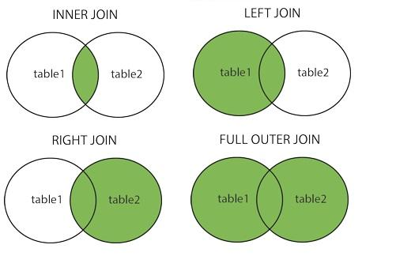

---
jupyter:
  jupytext:
    formats: ipynb,md
    text_representation:
      extension: .md
      format_name: markdown
      format_version: '1.1'
      jupytext_version: 1.2.4
  kernelspec:
    display_name: Python 3
    language: python
    name: python3
---

# 9.2 Types of Joins

In the previous section, we discussed how to _merge_ (or _join_) two data sets by matching on certain variables. But what happens when no match can be found for a row in one `DataFrame`? 

First, let's determine how _pandas_ handles this situation by default. The name "Nevaeh", which is "Heaven" spelled backwards, is said to have taken off when Sonny Sandoval of the band P.O.D. gave his daughter the name in 2000. Let's look at how common this name was four years earlier and four years after.

```python
import pandas as pd
pd.options.display.max_rows = 8

names1996 = pd.read_csv("http://github.com/dlsun/data-science-book/blob/"
                        "master/data/names/yob1996.txt?raw=true",
                        header=None,
                        names=["Name", "Sex", "Count"])
names2004 = pd.read_csv("http://github.com/dlsun/data-science-book/blob/"
                        "master/data/names/yob2004.txt?raw=true",
                        header=None,
                        names=["Name", "Sex", "Count"])
```

```python
names1996[names1996.Name == "Nevaeh"]
```

```python
names2004[names2004.Name == "Nevaeh"]
```

In 1996, there were no girls (or fewer than 5) named Nevaeh; just eight years later, there were over 3000 girls (and 27 boys) with the name. It seems like Sonny Sandoval had a huge effect.

What will happen to the name "Nevaeh" when we merge the two data sets?

```python
names = names1996.merge(names2004, on=["Name", "Sex"])
names[names.Name == "Nevaeh"]
```

By default, _pandas_ only includes combinations that are present in _both_ `DataFrame`s. If it cannot find a match for a row in one `DataFrame`, then the combination is simply dropped.


But in this context, the fact that a name does not appear in one data set is informative. It means that no babies were born in that year with that name. (Technically, it means that fewer than 5 babies were born with that name, as any name that was assigned fewer than 5 times is omitted for privacy reasons.) We might want to include names that appeared in only one of the two `DataFrame`s, rather than just the names that appeared in both. 

There are four types of joins, distinguished by whether they include names from the left `DataFrame`, the right `DataFrame`, both, or neither:

1. **inner join** (default): only values that are present in _both_ `DataFrame`s are included in the result
2. **outer join**: any value that appears in _either_ `DataFrame` is included in the result
3. **left join**: any value that appears in the _left_ `DataFrame` is included in the result, whether or not it appears in the right `DataFrame`
4. **right join**: any value that appears in the _right_ `DataFrame` is included in the result, whether or not it appears in the left `DataFrame`.

In _pandas_, the join type is specified using the `how=` argument.

Now let's look at examples of each of these types of joins.

```python
# inner join
names_inner = names1996.merge(names2004, on=["Name", "Sex"], how="inner")
names_inner
```

```python
# outer join
names_outer = names1996.merge(names2004, on=["Name", "Sex"], how="outer")
names_outer
```

Names like "Zyrell" and "Zyron" appeared in the 2004 data but not the 1996 data. For this reason, their count in 1996 is `NaN`. In general, there will be `NaN`s in a `DataFrame` resulting from an outer join. Any time a name appears in one `DataFrame` but not the other, there will be `NaN`s in the columns from the `DataFrame` whose data is missing.

```python
names_outer.isnull().sum()
```

By contrast, there are no `NaN`s when we do an inner join. That is because we restrict to only the (name, sex) pairs that appeared in both `DataFrame`s, so we have counts for both 1996 and 2014.

```python
names_inner.isnull().sum()
```

Left and right joins preserve data from one `DataFrame` but not the other. For example, if we were trying to calculate the percentage change for each name from 1996 to 2004, we would want to include all of the names that appeared in the 1996 data. If the name did not appear in the 2004 data, then that is informative.

```python
# left join
names_left = names1996.merge(names2004, on=["Name", "Sex"], how="left")
names_left
```

The result of a left join has `NaN`s in the column from the right `DataFrame`.

```python
names_left.isnull().sum()
```

The result of a right join, on the other hand, has `NaN`s in the column from the left `DataFrame`.

```python
# right join
names_right = names1996.merge(names2004, on=["Name", "Sex"], how="right")
names_right
```

```python
names_right.isnull().sum()
```

One way to visualize the different types of joins is using Venn diagrams. The shaded circles specify which values are included in the output.




# Exercises

Exercises 1-2 deal with the Movielens data (`/data301/data/ml-1m/`) that you explored in the previous section.


**Exercise 1.** Calculate the number of ratings by movie. How many of the movies had zero ratings?

(_Hint_: Why is an inner join not sufficient here?)

```python
# TYPE YOUR CODE HERE.
```

**Exercise 2.** How many movies received both a 1 and a 5 rating? Do this by creating and joining two appropriate tables.

```python
# TYPE YOUR CODE HERE.
```
