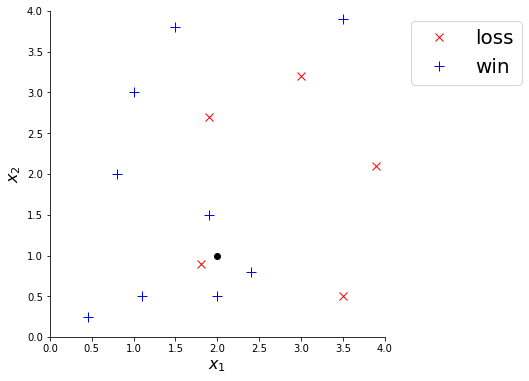
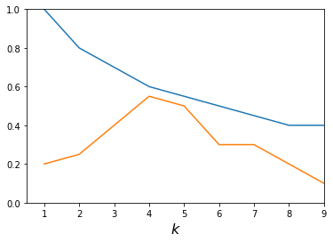

---
jupyter:
  jupytext:
    formats: ipynb,py
    text_representation:
      extension: .md
      format_name: markdown
      format_version: '1.1'
      jupytext_version: 1.2.3
  kernelspec:
    display_name: Python 3
    language: python
    name: python3
---

# Conceptual Quiz Preparation

At the beginning of class on Thursday, March 14, there will be a 30-minute quiz on machine learning. This quiz will count for 25% of your Exam 2 grade. This quiz will cover machine learning concepts such as:

- regression vs. classification
- training set vs. test set vs. validation set
- scoring metrics for measuring the performance of a machine learning model (e.g., RMSE, accuracy, etc.)
- $k$-nearest neighbors
- ensemble methods
- methods for text processing, such as bag of words and TF-IDF

To prepare, make sure you are familiar with the concepts in Chapters 5, 6, and 10 of the textbook. You may be asked to read and understand code on the quiz, but you will not have to write any code. The quiz will be open-book, like the exams.

Some examples of the kinds of questions I will ask are provided below.


## Example Question 1

For each of the following scenarios, determine whether a regression, classification, or clustering model is most appropriate.

**A.** You would like to build a machine learning model that predicts the price of a house, given information about the number of bedrooms, number of bathrooms, square footage, and other features.

**B.** You have a large database of handwritten digits. Each digit has been manually examined by a human and labeled as 0, 1, ..., 9. You would like to build a machine learning model on this data that, given a scan of a handwritten number, is able to recognize what number it is.


## Example Question 2

You are trying to predict whether a baseball team will win or lose based on features $x_1$ and $x_2$. You have training data, shown below.



You fit a 4-nearest neighbors model to this data. Use this model to predict the _probability_ that a team with $(x_1, x_2) = (2.0, 1.0)$, represented in the plot above as a black dot, will win...

**A.** ...if the distance metric is Euclidean distance.

**B.** ...if the distance metric is cosine distance.

<!-- #region -->
## Example Question 3

The plot below shows two curves that were produced for the purpose of choosing $k$ in a $k$-nearest neighbors model.



**A.** One of the two curves above was produced by running the following code for different values of `k`.

```
model = KNeighborsClassifier(n_neighbors=k)
cross_val_score(model, X_train, y_train, cv=10, scoring="accuracy").mean()
```

Which curve was it (blue or orange)?

**B.** Based on the plot above, which appears to be the best value of $k$?
<!-- #endregion -->

## Example Question 4

You are building a classifier to predict whether or not a Reddit comment will be controversial. You train your classifier on a training set of 10,000 Reddit comments, of which only 150 are controversial.

Your classifier predicts that every comment in the training set is non-controversial.

**A.** What is the accuracy of your classifier on the training set?

**B.** What is the precision of your classifier for identifying _non_-controversial tweets on the training set?

**C.** What is the recall of your classifier for identifying _non_-controversial tweets on the training set?

_Note:_ Your answers should be numbers between 0 and 1.
