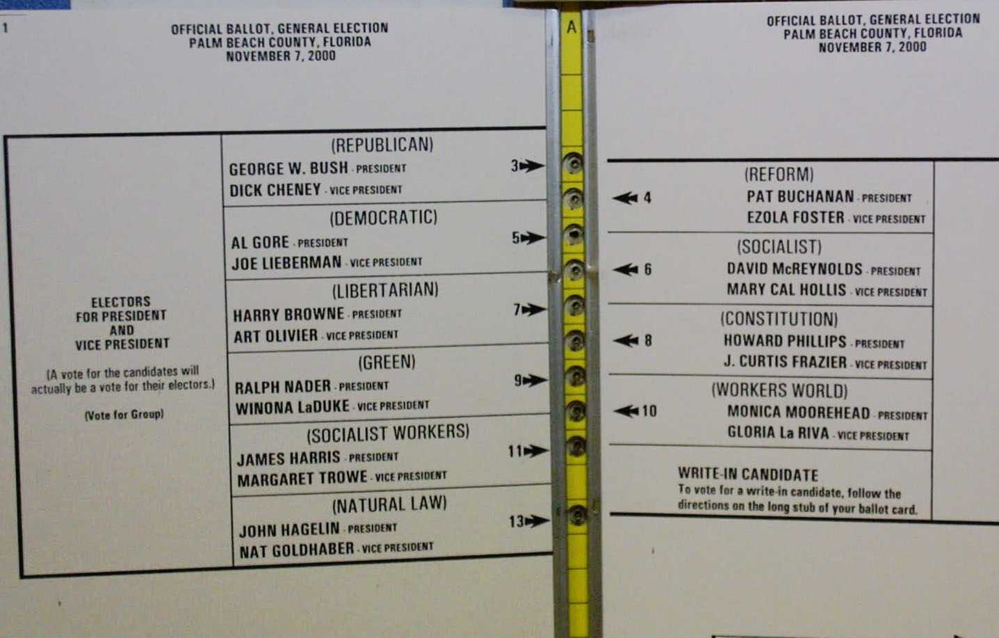

---
jupyter:
  jupytext:
    formats: ipynb,py
    text_representation:
      extension: .md
      format_name: markdown
      format_version: '1.1'
      jupytext_version: 1.2.3
  kernelspec:
    display_name: Python 3
    language: python
    name: python3
---

# The 2000 U.S. Presidential Election

The 2000 presidential election---between Republican George W. Bush, Democrat Al Gore, and other third-party candidates---was one of the closest in American history. The election came down to one state, Florida, which Bush won by just 537 votes (out of nearly 6,000,000 votes cast in the state).

After Election Day, Democrats claimed that the "butterfly ballot" that was used in Palm Beach County confused Gore voters into voting for Reform Party candidate Pat Buchanan. The ballot in question is shown below. To vote for Gore, who is listed second on the left, a voter actually had to punch the third hole (because the second hole is actually a vote for Buchanan, who is listed first on the right).



In this lab, you will evaluate this. The data file `https://raw.githubusercontent.com/dlsun/data-science-book/master/data/florida.csv` contains county-level information about:

- the number of votes for Gore, Bush, Buchanan (and a few other candidates) in the 2000 presidential election
- the number of votes for Clinton (Democrat), Dole (Republican), and Perot (Reform) in the 1996 presidential election
- the number of votes for Buchanan in the 1996 primary
- the number of registered Reform voters and the total number of registered voters

Using this data, evaluate the claim that many voters in Palm Beach County voted for Buchanan when they intended to vote for Gore. (_Hint:_ You should check whether Palm Beach County fits the general pattern of the other counties in Florida. Visualizations will likely be more helpful than summary statistics.) Then, craft a story that guides the reader through your discoveries. Your story should contain both figures and explanations.

```python
# YOUR CODE HERE
```

**YOUR EXPLANATION HERE** (You may need to add new cells as necessary.)


# Submission Instructions

Once you are finished, follow these steps:

1. Restart the kernel and re-run this notebook from beginning to end by going to `Kernel > Restart Kernel and Run All Cells`.
2. If this process stops halfway through, that means there was an error. Correct the error and repeat Step 1 until the notebook runs from beginning to end.
3. Double check that there is a number next to each code cell and that these numbers are in order.

Then, submit your lab as follows:

1. Go to `File > Export Notebook As > PDF`.
2. Double check that the entire notebook, from beginning to end, is in this PDF file. (If the notebook is cut off, try first exporting the notebook to HTML and printing to PDF.)
3. Upload the PDF [to PolyLearn](https://polylearn.calpoly.edu/AY_2018-2019/mod/assign/view.php?id=313949).
